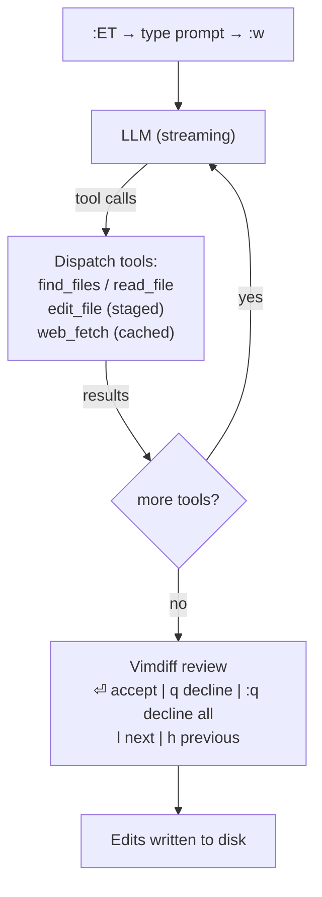

# ET.nvim

> Human-First Neovim AI Agent — a stateless tool-calling agent made for local models.

Supports [llama.cpp](https://github.com/ggerganov/llama.cpp) via `llama-server`
and [ds4.c](https://github.com/antirez/ds4) — the native DeepSeek V4 Flash inference engine.
Configure the provider via `:ETEditSettings` or `setup()` opts.

---

## Features

- **Stateless agent** — fresh context per invocation, no stale conversations
- **Agent Tool-calling loop** — `find_files`, `read_file`, `edit_file`, `web_fetch`
- **Vimdiff review** — inspect every change side-by-side before it's written to disk
- **Brave Search** — web, news, images, videos with result trees
- **Context7** — library documentation lookup with dual-panel UI
- **Per-project System Prompt** — persistent system prompt additions scoped to working directory
- **Vim motion** — `:w<CR>` to submit, `q` to close, `h/l` to switch tabs, `<C-w>h/j/k/l` to focus between components

---

## Why Human-First

LLMs ship with frozen training data. When a library releases a breaking
change, the model has no way to know — it will confidently generate
outdated code. ET.nvim puts **you** in control of the agent's knowledge:

1. **Search** — `:ETBraveSearch` or `:ETContext7` finds the latest docs,
   changelogs, and code examples
2. **Curate** — browse results, pick what's relevant
3. **Inject** — `:ETAddToSystemPrompt` feeds curated knowledge into the
   agent's system prompt (per-project, persists across restarts)
4. **Act** — the agent now codes against current reality, not stale
   training data

The human researches, the agent executes — each doing what they're best at.

---

## Requirements

| Type | Dependency | Purpose |
|------|-----------|---------|
| Neovim | >= 0.9 | Lua APIs, floating windows |
| Plugin | [nui.nvim](https://github.com/MunifTanjim/nui.nvim) | Popup, Menu, Input, Layout, Tree |
| Plugin | [fzf-lua](https://github.com/ibhagwan/fzf-lua) | File picker (`:ETFilePicker`) |
| External | `bx` | Brave Search CLI |
| External | `ctx7` | Context7 documentation CLI |
| External | `lynx` | HTML-to-text for web_fetch (optional on Windows) |
| External | `jq` | JSON filtering for Brave Search results |
| Optional | `fixjson` | JSON formatter (install via Mason or `npm i -g fixjson`) |

Run `:ETInstallTools` to install all external tools in one command.

---

## Installation

### lazy.nvim

```lua
{
  'FramedStone/ET-nvim',
  dependencies = {
    'MunifTanjim/nui.nvim',
    'ibhagwan/fzf-lua',
  },
  opts = {
    -- All fields optional — omit to configure later via :ETEditSettings
    endpoint = 'http://localhost:8080/v1',
    model = 'my-model',         -- omit to auto-pick first available model
  },
}
```

With custom keymaps:

```lua
{
  'FramedStone/ET-nvim',
  dependencies = {
    'MunifTanjim/nui.nvim',
    'ibhagwan/fzf-lua',
  },
  keys = {
    { '<leader>ea', ':ET<CR>',             desc = 'ET Chat' },
    { '<leader>eb', ':ETBraveSearch<CR>',  desc = 'ET Brave Search' },
    { '<leader>ec', ':ETContext7<CR>',     desc = 'ET Context7' },
    { '<leader>er', ':ETWebFetchResults<CR>', desc = 'ET Web Fetch Results' },
  },
  opts = { model = 'my-model' },
}
```

Or explicit `config` function:

```lua
{
  'FramedStone/ET-nvim',
  dependencies = { 'MunifTanjim/nui.nvim', 'ibhagwan/fzf-lua' },
  config = function()
    require('ET').setup({
      endpoint = 'http://localhost:8080/v1',
      model = 'my-model',
    })
  end,
}
```

### Config options

All fields passed via `opts` or `setup({...})` are deep-merged into the
config file (`~/.config/nvim/.et/config.json`) and can be changed later
with `:ETEditSettings`.

| Field | Type | Default | Description |
|-------|------|---------|-------------|
| `provider` | string | `llama.cpp` | Backend: `llama.cpp` or `ds4` |
| `endpoint` | string | per-provider | Provider-specific base URL |
| `model` | string | per-provider | Model ID (auto for llama.cpp, `deepseek-v4-flash` for ds4) |
| `api_key` | string | — | API key (required for remote providers, optional for ds4 local) |
| `reasoning_effort` | string | — | ds4 only: `low`, `medium`, `high`, or `max` for Think Max |
| `system_prompt` | string | tools-only prompt | Custom system prompt |
| `sampling_params` | table | `{}` | Pass-through to `/chat/completions` |

### Provider Defaults

When switching providers, set the `provider`, `endpoint`, and `model` fields
via `:ETEditSettings`. Defaults per provider:

| Provider | Default Endpoint | Default Model |
|----------|-----------------|---------------|
| `llama.cpp` | `http://localhost:8080/v1` | auto (first available via `/v1/models`) |
| `ds4` | `http://127.0.0.1:8000/v1` | `deepseek-v4-flash` |

`sampling_params` supports all standard fields. These are passed directly
to the API — any field set to `nil` is omitted (falls back to the server's defaults).

```lua
sampling_params = {
  temperature = 0.7,
  max_tokens = 4096,
  top_p = 0.9,
  -- top_k, repetition_penalty, presence_penalty, seed, stop, etc.
  chat_template_kwargs = {
    enable_thinking = true,   -- boolean: for DeepSeek-R1 / Qwen-thinking models
    thinking_budget = 4096,   -- integer: max tokens for reasoning (-1 = unlimited)
  },
}
```

`chat_template_kwargs` are passed into the model's Jinja template. Available
keys depend on the model — the two above are the most common.

---

## Quick Start

1. Start llama-server:
   ```bash
   llama-server -m model.gguf --port 8080 --alias my-model
   ```
   > Jinja templating is enabled by default. No extra flags needed.
   > Use a tool-calling-capable model (Qwen 2.5, Llama 3.1+, Mistral, etc.).

2. Install ET.nvim (see [Installation](#installation)). `:ET` to chat.

## First Run

1. `:ETEditSettings` — review or edit the endpoint and model
2. `:ETSwitchModel` — pick a model from the available list
3. `:ET` — open the chat popup, type a prompt, press `:w<CR>` to send

On first load, ET.nvim checks that `bx`, `ctx7`, `jq`, and `lynx` are
installed. If any are missing, a notification shows with instructions
to run `:ETInstallTools`.

---

## Commands

| Command | Description |
|---------|-------------|
| `:ET [range]` | Open chat popup. Visual range pre-fills the selection with file path and line anchor. `:w<CR>` to send. |
| `:ETSwitchModel` | Menu to pick from available models on the configured endpoint |

| `:ETEditSettings` | Edit `config.json` in a popup. `:w<CR>` to save. |
| `:ETFilePicker` | fzf-lua file picker. Selected paths are inserted into the current buffer. |
| `:ETBraveSearch` | Brave Search UI — type selector (web/news/images/videos), query input, result tree |
| `:ETContext7` | Context7 dual-panel — search libraries on the left, query docs on the right |
| `:ETContext7AddToDocs` | Copy selected library result to the docs library input |
| `:ETWebFetchResults` | Paginated view of web pages cached during the last agent run |
| `:ETAddToSystemPrompt [range]` | Add selection or focused tree result to persistent system prompt |
| `:ETAddToPrompt [range]` | Add selection or focused tree result to the next prompt (one-shot) |
| `:ETSystemPrompt` | View and edit the full system prompt. `:w<CR>` to save. |
| `:ETInstallTools` | Install missing external tools (bx, ctx7, jq, lynx) |

---

## How It Works



---

## Keybindings

### All popups

| Key | Action |
|-----|--------|
| `:w<CR>` | Submit / save / run search |
| `:wq<CR>` | Submit and close |
| `q`, `:q<CR>` | Close without saving |
| `<C-w>h` | Focus component to the left |
| `<C-w>j` | Focus component below |
| `<C-w>k` | Focus component above |
| `<C-w>l` | Focus component to the right |
| `<Tab>` | Cycle to next component |
| `<S-Tab>` | Cycle to previous component |
| `<C-w>w`, `<C-w><C-w>` | Cycle to next Neovim window |

### Tree components (search results)

| Key | Action |
|-----|--------|
| `<CR>` | Open URL (on leaf) / toggle (on parent) |
| `t` | Toggle expand / collapse node |

### Web Fetch Results

| Key | Action |
|-----|--------|
| `l` | Next page |
| `h` | Previous page |

### Edit Review (vimdiff)

| Key | Action |
|-----|--------|
| `<CR>` | Accept this edit |
| `q` | Decline this edit |
| `:q<CR>` | Decline all remaining edits |
| `l` | Next edit |
| `h` | Previous undecided edit |

---

## License

AGPL-3.0 — see [LICENSE](./LICENSE)

For full documentation, see `:help ET` inside Neovim.
